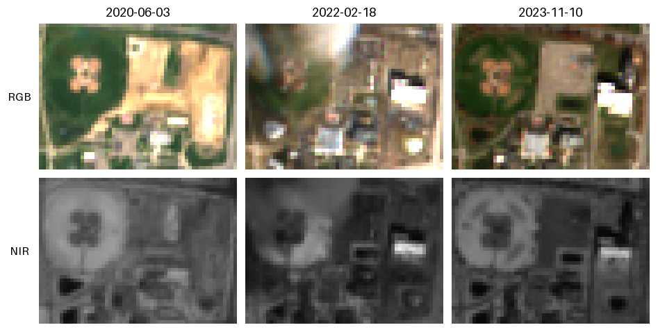

# Construction Site Satellite Imagery Collection

`cssic` finds the OpenStreetMap construction sites in a region and date window,
recovers when each one actually started and finished, and downloads Sentinel-2
or Planet image chips (RGB and NIR) spread across its construction period.

It is the code for [*A Framework for Semi-automatic Collection of Temporal
Satellite Imagery for Analysis of Dynamic
Regions*](https://openaccess.thecvf.com/content/ICCV2021W/LUAI/html/Motlagh_A_Framework_for_Semi-Automatic_Collection_of_Temporal_Satellite_Imagery_for_ICCVW_2021_paper.html)
(ICCV 2021 Workshops, LUAI), rebuilt in 2026 as a tested Python package (v3).



*One construction chain from the quickstart below, on the Ohio State campus
(`way-810271578-9`). OSM history places construction between 2020-06-01 and
2023-11-06 on land previously tagged `landuse=grass`, and `gather -n 3` sampled
the start, middle and end of that period. Sentinel-2 L2A chips from Planetary
Computer at 10 m (57 x 42 px each), enlarged 5x with nearest-neighbour
sampling; the middle acquisition is partly hazy. Contains modified Copernicus
Sentinel data (2020-2023).*

## Quickstart (no account needed)

Needs Python 3.10+ and [uv](https://docs.astral.sh/uv/). OSM history comes from
the public [ohsome API](https://docs.ohsome.org/ohsome-api/stable/) and imagery
from Microsoft Planetary Computer's Sentinel-2 L2A STAC catalog; neither needs a
key.

```bash
git clone --branch modernize-v3 \
  https://github.com/nmotlagh/Construction-Site-Satellite-Imagery-Collection.git
cd Construction-Site-Satellite-Imagery-Collection
uv sync --extra stac

uv run cssic setup
uv run cssic extract -s 2023-01-01 -e 2023-03-01 --poly poly/campus.poly
uv run cssic gather -s stac --rgb --nir -n 3
```

`extract` searches OSM history for construction on the demo campus polygon
during January and February 2023 and writes the chains to
`output/collection/collection.{gpkg,geojson,shp}`. `gather` then writes up to
three RGB and NIR chips per completed chain under
`output/{chain_id}/images/sentinel/`.

When this README was last checked (September 2026), the run found 23 completed
chains (4 still in progress were skipped) and wrote 110 chips. The extract step
is the slow one: it read 51 daily snapshots from the public ohsome API and took
about 50 minutes, while `gather` took about a minute. Snapshots are cached
under `temp/snapshots/`, so a re-run replays from disk.

`demo.ipynb` runs the same two steps through the Python API
(`uv sync --extra notebook`, then `uv run jupyter lab demo.ipynb`).

## How it works

Given a region polygon and a date window, `cssic extract` finds every OSM *way*
tagged `landuse=construction` or `building=construction` that was under
construction inside the window. Each site is a **construction chain**: one
physical site that may be represented by several OSM way ids over time (a way is
deleted and re-drawn, split, or re-tagged). Backends are queried by bounding
box, but the collection is clipped to the polygon itself. Only ways seed chains;
relations still supply boundary tags.

For each chain the extractor recovers:

- the **true start date**, by walking backward in time before the window,
- the **true end date**, by walking forward after it,
- the **previous tag**: what the land was before construction, read from the
  best-overlapping tagged polygon on the day before the start,
- the **final tag**: the best-overlapping tagged polygon on the day after the end.

"Best" is intersection-over-union (IOU) against a confidence threshold; weak
overlaps become `NO TAG FOUND`. Chain links are kept only when IOU clears
`construction_chain_confidence`, so a boundary tag is never literally
`construction`.

`cssic gather` then takes each **completed** chain, samples `n` dates evenly
across `[start, end]` (both endpoints included when `n >= 2`; `-n 1` samples the
start and `-n -1` means every available acquisition), pads the bounding box by
an area scale factor around its centre, and writes RGB and/or NIR chips. Chains
still under construction at the end of the search are reported as in progress
and are not eligible for imagery.

## Architecture

The paper algorithm is written against two small protocols, so where the
history and the pixels come from is a backend choice:

```
.poly region + date window
        |
        v
HistorySource          ohsome API (default)  |  osmium-tool + Geofabrik .osh.pbf
        |              construction_intervals(bbox, window), snapshot(day, bbox)
        v
chains.build_chains    construction chains, true start/end, IOU boundary tags
        |
        v
Workspace              output/collection/collection.{gpkg,geojson,shp}, info.txt
        |
        v
imagery backend        Planetary Computer STAC  |  Sentinel Hub / CDSE  |  Planet Orders v2
        |              find_scenes(aoi, start, end), fetch(scene, aoi, band)
        v
output/{chain_id}/images/{sentinel|planet}/{rgb|nir}/{YYYY-MM-DD}.png
```

| Module | Role |
| --- | --- |
| `cssic/cli.py` | `argparse` front end. User errors become one `ERROR: ...` line and exit code 2, not a traceback. |
| `cssic/extract.py`, `cssic/gather.py` | The two commands, also callable from Python. |
| `cssic/config.py` | Frozen `ExtractConfig`, `GatherConfig`, `Credentials`; all input validation lives here. |
| `cssic/chains.py` | The paper algorithm, pure functions over a `HistorySource`. |
| `cssic/sites.py` | `Site` and `SiteCollection`; chain ids are assigned by the collection, so the same input gives the same ids. |
| `cssic/history/` | `HistorySource` protocol plus the `ohsome` and `osmium` backends. |
| `cssic/imagery/` | `ImageSource` protocol plus the `stac`, `sentinelhub` and `planet` backends; `chips.py` holds the shared padding, reprojection, blank-chip check and PNG writing. |
| `cssic/store.py` | `Workspace`: the on-disk layout of `temp/` and `output/`. |
| `cssic/geom.py`, `poly.py`, `dates.py`, `deps.py` | Geometry helpers, `.poly` parser, date sampling, optional-dependency checks. |

Design choices that follow from this:

- Every network client (HTTP session, STAC client, Sentinel Hub request, Planet
  client, osmium runner) is a constructor argument, so tests inject fakes and an
  alternative source is a class that satisfies the protocol in
  `cssic/history/base.py` or `cssic/imagery/base.py`.
- Heavy backend stacks are optional extras imported lazily. `import cssic`
  works with none of them installed, and a missing extra is reported as an
  install hint.
- Nothing in the package mutates global state; chain serial numbers are
  handed out by the `SiteCollection` that owns them, not by a module- or
  class-level counter.

[docs/ARCHITECTURE.md](docs/ARCHITECTURE.md) is the module-by-module contract;
[docs/PLANET_SENTINEL.md](docs/PLANET_SENTINEL.md) collects notes on the
third-party APIs (Planet, Sentinel Hub, pyosmium, GeoPandas).

### History backends (`cssic extract --backend`)

Both feed the same `cssic.chains.build_chains`, so both produce the paper's
chains, dates and boundary tags.

- **`ohsome`** (default) queries HeiGIT's ohsome API.
  `elementsFullHistory/geometry` with the filter `(landuse=construction or
  building=construction) and geometry:polygon and type:way` gives every stretch
  during which a way carried a construction tag. Daily neighbourhood snapshots
  (every polygon with a tag that says what the land *is*: `landuse`, `leisure`,
  `amenity`, `building`, `natural`, ..., relations included) are what the
  boundary tags are ranked from. Snapshots normally use `elements/geometry?time=`;
  when that endpoint is unavailable (the public deployment currently answers
  `403`) the backend falls back to a one-day full-history query. A `413` splits
  the bounding box into quadrants and retries; `429`/`5xx` back off
  exponentially. Queries are clamped to the API's temporal extent, which trails
  today by days to weeks. Snapshots are cached under `temp/snapshots/`.
- **`osmium`** is the original 2020 path, kept so the paper's results can be
  reproduced from a fixed dump: `osmium extract` clips a Geofabrik `.osh.pbf`
  history file to the polygon and per-day snapshots are read with
  `osmium time-filter` and pyosmium. It needs the `osmium-tool` binary and a
  history file (see [History files](#history-files-geofabrik-oshpbf)), and it
  is much slower, but it needs no network.

### Imagery backends (`cssic gather -s`)

| `-s` | Backend | Credentials | Notes |
| --- | --- | --- | --- |
| `stac` | Planetary Computer Sentinel-2 L2A | none | Prefers a scene that covers the whole AOI, keeps the acquisition least cloudy *over the site* (L2A SCL band) per sampled window, and applies the baseline-04.00 `BOA_ADD_OFFSET` so post-2022 chips are not about 10% too bright. |
| `s` / `sentinel` | Sentinel Hub Process API (CDSE by default) | `SH_CLIENT_ID` / `SH_CLIENT_SECRET` | Catalog for dates, Process API for pixels, 10 m. |
| `p` / `planet` | Planet PSScene + Orders API v2 | `PLANET_API_KEY` or `planet auth login` | Asynchronous: order, then download. Orders are clipped and reprojected to EPSG:4326. |

All three reproject the WGS84 AOI into the raster's CRS before windowing, write
8-bit PNGs, and refuse to write a chip with no signal: one whose pixels all sit
within 8 levels of each other, whether nodata (the scene only caught a corner of
the site) or flat cloud or snow.

## Tests

```bash
uv sync --extra dev
uv run ruff check .
uv run ruff format --check .
uv run pytest -q
```

The suite does not touch the network: HTTP sessions, STAC clients, Sentinel Hub
requests, Planet clients and the osmium runner are injected at the constructor
boundary and faked. Planet order requests still go through the real Planet SDK
request builders, with its product-bundle spec stubbed so validation stays
offline. The two tests that need the `osmium-tool` binary skip when it is
absent. GitHub Actions ([`.github/workflows/ci.yml`](.github/workflows/ci.yml))
runs the same commands on Python 3.10 and 3.12, plus a job that installs only
the core dependencies and checks that `import cssic` works with no extra
present.

## Citation

If you use this code, please cite the paper:

```bibtex
@InProceedings{Motlagh_2021_ICCV,
    author    = {Motlagh, Nicholas Kashani and Radhakrishnan, Aswathnarayan and Davis, Jim and Ilin, Roman},
    title     = {A Framework for Semi-Automatic Collection of Temporal Satellite Imagery for Analysis of Dynamic Regions},
    booktitle = {Proceedings of the IEEE/CVF International Conference on Computer Vision (ICCV) Workshops},
    month     = {October},
    year      = {2021},
    pages     = {704-712},
    doi       = {10.1109/ICCVW54120.2021.00084}
}
```

## Authors, maintenance and license

Original authors:

- Nicholas Kashani Motlagh, Aswathnarayan Radhakrishnan, and
  [Jim Davis](http://web.cse.ohio-state.edu/~davis.1719/) (Ohio State University)
- Roman Ilin (AFRL/RYAP, Wright-Patterson AFB)

This repository is Nick Kashani Motlagh's maintained fork of the original Ohio
State Computer Vision Lab code,
[`osu-cvl/Construction-Site-Satellite-Imagery-Collection`](https://github.com/osu-cvl/Construction-Site-Satellite-Imagery-Collection),
which is not modified here. The v3 rewrite lives on the `modernize-v3` branch.
Point of contact for this fork: Nick ([@nmotlagh](https://github.com/nmotlagh)).
The original OSU address `davis.1719@osu.edu` is author credit, not the support
address for this repository.

Licensed under [GPL-3.0](LICENSE).

---

The rest of this file is reference material: installation options,
credentials, the full CLI, the output format and the Python API.

## Installing

`pyproject.toml` is the source of truth and `uv.lock` pins the whole tree. The
heavy backends are extras: `osmium`, `stac`, `sentinelhub`, `planet`, and `all`.
`dev` adds everything plus pytest and ruff; `notebook` adds JupyterLab and
matplotlib.

```bash
uv sync --extra dev            # every backend plus the test tools
```

Or with pip, in a Python 3.10+ virtualenv:

```bash
python3 -m venv .venv
source .venv/bin/activate
pip install -e ".[dev]"
```

**Only for `--backend osmium`:** install the **osmium-tool** system package as
well (the `osmium` Python wheel is not enough).

- Debian / Ubuntu: `sudo apt install -y osmium-tool`
- macOS: `brew install osmium-tool`
- Otherwise build from [osmcode/osmium-tool](https://github.com/osmcode/osmium-tool);
  on Windows, WSL + Ubuntu is the least painful path.

Confirm with `osmium --version`.

## Credentials

Only the Sentinel Hub / CDSE and Planet backends need credentials. Copy the
example env file and fill in the keys you need; never commit `.env`.

```bash
cp .env.example .env
```

| Provider | What to set | Notes |
| --- | --- | --- |
| **Sentinel-2, Planetary Computer STAC** (`gather -s stac`) | nothing | Open API; asset hrefs are signed automatically. |
| **Sentinel-2, CDSE Process API** (`gather -s s`) | `SH_CLIENT_ID`, `SH_CLIENT_SECRET`, `SENTINEL_PROVIDER=cdse` | Create an OAuth client at the [Copernicus Data Space dashboard](https://shapps.dataspace.copernicus.eu/dashboard/#/account/settings). The secret is shown once. |
| **Sentinel-2, commercial Sentinel Hub** (`gather -s s`) | `SH_CLIENT_ID`, `SH_CLIENT_SECRET`, `SENTINEL_PROVIDER=sentinelhub` | Optional. A commercial Sentinel Hub OAuth client is *not* interchangeable with a CDSE one. |
| **Planet** (`gather -s p`) | `PLANET_API_KEY`, or leave it empty and run `planet auth login` | Legacy Planet API keys still work. `PL_API_KEY` is also read. |

Old Sentinel Hub instance ids will not work: the 2020-era `apps.sentinel-hub.com`
configuration / instance-id flow has been removed, and CDSE free access is
OAuth + Process API.

Credentials are read from `.env` and the environment by
`Credentials.from_env()`. Each can also be passed on the gather command
(`--api`, `--sh-client-id`, `--sh-client-secret`, `--sentinel-provider`).

## Workspaces and regions

By default, `temp/` and `output/` are rooted in the current directory. To keep
a region or date-window run separate, pass the global `--workspace DIR` option
**before the subcommand**:

```bash
cssic --workspace runs/campus setup
cssic --workspace runs/campus extract -s 2023-01-01 -e 2023-03-01 --poly poly/campus.poly
cssic --workspace runs/campus gather -s stac --rgb --nir -n 3
```

All commands use that workspace, including Planet order/download logs and the
two reset commands. This does not change the working directory: relative
`--poly` and `--region` paths, and `.env` lookup, still refer to the directory
where you invoke `cssic`.

Two demo regions ship in [Osmosis polygon
format](https://wiki.openstreetmap.org/wiki/Osmosis/Polygon_Filter_File_Format)
(`lon lat` rings):

- `poly/campus.poly`: an **approximate** box around the Ohio State University
  Columbus campus. One ring, no holes; fine for a first run.
- `poly/osu.poly`: the real campus boundary, OSM relation 306632. Several
  disjoint outer rings, so it is also the multi-section case.

Any `.poly` works. To make one for your own region, find its OSM relation id
(search on [nominatim.openstreetmap.org](https://nominatim.openstreetmap.org/))
and download the polygon:

```bash
curl -o poly/myregion.poly \
  "https://polygons.openstreetmap.fr/get_poly.py?id=306632&params=0"
```

Geofabrik also publishes `.poly` files for its regions under "Other Formats and
Auxiliary Files".

## CLI reference

`cssic` is the only entry point. There is no GUI on purpose: ohsome and osmium
jobs can run long, and Planet orders consume quota. The blocks below are real
`cssic <command> --help` output, with the top-level epilog re-wrapped (argparse
prints it as a single long line).

```
usage: cssic [-h] [--workspace DIR]
             {setup,extract,gather,reset-extract,reset-images} ...

Extract OSM construction sites and download Sentinel-2 / Planet imagery.

positional arguments:
  {setup,extract,gather,reset-extract,reset-images}
    setup               Create temp/ and output/ directories
    extract             Extract construction sites (ohsome by default)
    gather              Download imagery for extracted sites
    reset-extract       Delete extract outputs
    reset-images        Delete downloaded imagery

options:
  -h, --help            show this help message and exit
  --workspace DIR       Directory containing temp/ and output/ (default:
                        current directory)

No GUI: ohsome/osmium jobs can be long and Planet orders use quota.
Credentials come from the environment (see .env.example). Planet:
PLANET_API_KEY or `planet auth login`. Sentinel STAC (`gather -s stac`)
needs no key. Process API (`gather -s s`): SH_CLIENT_ID / SH_CLIENT_SECRET
from the CDSE dashboard.
```

### `cssic extract`

```
usage: cssic extract [-h] -s START -e END -p POLY [-r REGION]
                     [--backend {ohsome,osmium}] [--keep-temp]
                     [--restrict-window] [--save-wip] [-v | -q]

options:
  -h, --help            show this help message and exit
  -s START, --start START
                        Start date YYYY-MM-DD (on or after 2015-06-22)
  -e END, --end END     End date YYYY-MM-DD (more than 10 days before today)
  -p POLY, --poly POLY  Path to an Osmosis .poly file
  -r REGION, --region REGION
                        Path to an OSM history .osh.pbf file (required for
                        --backend osmium)
  --backend {ohsome,osmium}
                        ohsome API (default) or original osmium daily
                        snapshots
  --keep-temp           Keep the per-day osmium dumps in temp/snapshots (the
                        ohsome snapshot cache is always kept)
  --restrict-window     Do not search before start / after end for true
                        construction dates
  --save-wip            Also save in-progress sites
  -v, --verbose         Also echo the day-by-day walk (one line per observed
                        day)
  -q, --quiet           Print nothing but the final summary
```

Notes the help text has no room for:

- `--start` must be on or after **2015-06-22** (the day before Sentinel-2's
  first acquisition) and `--end` **more than 10 days** in the past, because OSM
  history and the ohsome API both trail reality. An `--end` exactly 10 days ago
  is rejected.
- By default the run prints a line per phase, `[snapshot N] YYYY-MM-DD` as each
  daily snapshot is read, and `Read N daily snapshot(s)` at the end. `-v` adds
  the day-by-day walk; `-q` prints nothing but the final summary.
- `--keep-temp` governs the per-day **osmium** dumps only. The ohsome snapshot
  cache under `temp/snapshots/` is always kept; it is keyed by day and bounding
  box, so a re-run replays from it instead of re-querying the API.
- `--restrict-window` skips the backward and forward walks entirely, so start
  and end dates are clipped to the requested window rather than being the true
  ones. On osmium that also skips the extra per-day dumps; on ohsome the time
  saved is small, since the history query is one call either way.
- Chains still under construction at `--end` are dropped with a `Skipped N
  chain(s) still in progress at <end>` line. `--save-wip` additionally writes
  them to `output/collection/in_progress.*`; they are never used for imagery,
  and their `end` is the last day they were seen under construction.
- Exit code `2` means invalid arguments or no completed chains found. Every
  user-facing failure (a malformed `.poly`, a bad date, a missing osmium stack)
  is one `ERROR: ...` line and exit `2`, never a traceback.

```bash
# default: ohsome, no history dump needed
cssic extract -s 2023-01-01 -e 2023-03-01 --poly poly/campus.poly

# the 2020 path: a local Geofabrik history extract
cssic extract -s 2023-01-01 -e 2023-03-01 --poly poly/campus.poly \
  --backend osmium --region path/to/ohio-internal.osh.pbf
```

### `cssic gather`

```
usage: cssic gather [-h] -s SOURCE [-n NUM_IMAGES] [-p PADDING]
                    [--day-padding DAY_PADDING] [-C] [-N]
                    [--max-cloud MAX_CLOUD] [-v] [-e] [--api API] [--download]
                    [--sh-client-id SH_CLIENT_ID]
                    [--sh-client-secret SH_CLIENT_SECRET]
                    [--sentinel-provider {cdse,sentinelhub}]

options:
  -h, --help            show this help message and exit
  -s SOURCE, --source SOURCE
                        'p'/'planet', 's'/'sentinel' (Process API), or 'stac'
  -n NUM_IMAGES, --num-images NUM_IMAGES
                        Number of samples across the construction period
                        (>=1), or -1 for every date
  -p PADDING, --padding PADDING
                        Area scale factor (1 = exact bbox)
  --day-padding DAY_PADDING
                        Days the search reaches past each sampled date
                        (default: 6, the v2 value)
  -C, --rgb             Download RGB (at least one of --rgb / --nir)
  -N, --nir             Download NIR
  --max-cloud MAX_CLOUD
                        Discard acquisitions cloudier than this percentage
                        (default: keep all)
  -v, --verbose
  -e, --email           Planet email notification when an order is ready
  --api API, --api-key API
                        Planet API key (or PLANET_API_KEY)
  --download, --download-planet
                        Download previously created Planet orders
  --sh-client-id SH_CLIENT_ID
                        Sentinel Hub / CDSE OAuth client id
  --sh-client-secret SH_CLIENT_SECRET
                        Sentinel Hub / CDSE OAuth client secret
  --sentinel-provider {cdse,sentinelhub}
                        cdse (default, Copernicus Data Space) or commercial
                        sentinelhub
```

Notes the help text has no room for:

- At least one of `--rgb` / `--nir` is required.
- `-n` accepts any `n >= 1`, or `-1` for every available acquisition. The v2
  "at least 3" rule is gone: `-n 1` samples the start; both endpoints are
  sampled from `-n 2` up.
- `-p/--padding` is an **area** scale factor applied around the box's centre,
  so `-p 2` doubles the area, not the side length. `-p 1` is the exact box.
- `--day-padding` sets how far past a sampled date the search reaches: a window
  covers the sampled date through `--day-padding` days later, both ends
  included. `--day-padding 0` searches the sampled date alone, and no chip can
  post-date a chain's `end` by more than `--day-padding` days.
- `--max-cloud` is honoured by all three backends (an `eo:cloud_cover` search
  bound on `stac` / `s`, a `cloud_cover` range filter on Planet). It is
  scene-level everywhere (a 110 km tile can be 20% cloudy and still be solid
  cloud over one site), so treat it as a coarse pre-filter.
- On `stac`, the acquisition kept for a sampled window is the one least cloudy
  **over the site**, measured from the L2A SCL band (cloud, shadow, cirrus,
  snow) rather than the scene-wide `eo:cloud_cover`; unobserved (SCL 0) pixels
  count for neither side. Reprocessed duplicates of one overpass collapse to one
  candidate first, then at most the five least-cloudy acquisitions are ranked
  that way; a window with a single candidate is not checked at all. `-v` prints
  the per-candidate choice.
- Sentinel-2 (`stac` and `s`) clamps the search start to **2015-06-23**, its
  first acquisition; sites that started earlier are collected, they simply have
  no imagery before that date. Planet *skips* a chain that started before
  **2017-02-19**.
- Planet is a two-step **order, then download**: a first run places clipped
  PSScene orders and logs them in `temp/order_log.txt`; re-run with `--download`
  once Planet reports them ready. An order whose delivery yields no usable chip
  stays in `temp/order_log.txt` (its staging directory kept) instead of being
  retired to `temp/order_log_complete.txt`.
- A Planet account needs a plan (trial, paid, or the Education & Research
  program) before it may download anything; a bare account sees the archive
  but every search comes back empty under the permission filter. gather
  detects that case and prints a `WARNING: ... not permitted to download` line
  once, rather than silently ordering nothing.
- Per chain, gather prints `<chain>: no acquisition between <a> and <b>` for
  every window that came back empty, and closes with `<chain>: wrote K of N
  requested samples`.
- A per-site search or fetch failure is logged and skipped, not fatal: a gather
  run can take hours. Chips with no signal are reported as `SKIPPED blank` and
  not written.

```bash
# Sentinel-2 via Planetary Computer STAC (no key)
cssic gather -s stac --rgb --nir -n 3 --verbose

# Sentinel-2 L2A via the Copernicus Data Space Process API
cssic gather -s s --rgb --nir -n 3 --verbose

# Planet: place PSScene orders, then collect them later
cssic gather -s p --rgb --nir -n 3 --verbose
cssic gather -s p --rgb --nir --download
```

### `cssic setup` / `reset-extract` / `reset-images`

None of the three takes an option, and each says what it did.

```
$ cssic setup
Ready: temp/snapshots and output/collection
```

`setup` creates `temp/snapshots/` and `output/collection/`. `reset-extract`
empties both (the collection, every `output/{chain_id}/` folder and the cached
snapshots), so copy anything you want to keep first. `reset-images` deletes only
the downloaded chips, leaving the collection table and each site's `info.txt` in
place. Both resets print how many files they removed.

## Output

```
output/collection/collection.gpkg        # primary
output/collection/collection.geojson
output/collection/collection.shp         # + .dbf/.shx/.prj/.cpg
output/collection/in_progress.*          # only with --save-wip
output/{chain_id}/info.txt
output/{chain_id}/images/{planet|sentinel}/{rgb|nir}/{YYYY-MM-DD}.png
temp/snapshots/                          # cached daily snapshots
temp/order_log.txt                       # outstanding Planet orders
temp/order_log_complete.txt              # collected Planet orders
```

Each row of the collection is one construction chain, with columns `chain_id`,
`start`, `end`, `constr_tag`, `prev_tag`, `final_tag` and a bounding-box
geometry in EPSG:4326. A `chain_id` joins the chain's OSM ids with `_` and
appends a serial number, e.g. `way-1077541392_way-1235102886-25`. Serials are
assigned by the collection, not by a process-global counter, so the same input
produces the same ids.

`info.txt` is a single comma-separated line:

```
start,end,prev_tag,final_tag,minx,miny,maxx,maxy
```

OSM tag values are free text, so tag fields are whitespace-collapsed and any
comma inside them becomes a semicolon; the file stays eight fields wide.

Planet writes two extra kinds of file: `{date}_mask.png` beside an RGB chip
(the visual bundle's alpha / unusable-pixel band) and `{date}_udm.tif` in the
NIR directory (the delivered UDM2 mask). With `-n -1`, days inside the
construction period that produced no acquisition get a blank `{date}_empty.png`.

The layout is unchanged from v2, so existing datasets stay valid.

## History files (Geofabrik `.osh.pbf`)

Only needed for `--backend osmium`. Extraction needs a **full-history** extract
covering your polygon, not a current-snapshot `.osm.pbf`.

1. Create a free [OpenStreetMap account](https://www.openstreetmap.org/user/new).
2. Open the regional page on [download.geofabrik.de](https://download.geofabrik.de)
   (Ohio demo: [north-america/us/ohio.html](https://download.geofabrik.de/north-america/us/ohio.html)).
3. Scroll to **Other Formats and Auxiliary Files**. The history file (`.osh.pbf`)
   is served from Geofabrik's **internal** server and requires an OSM login:
   [osm-internal.download.geofabrik.de](https://osm-internal.download.geofabrik.de/).
4. Click **internal server**, sign in, and download the `*-internal.osh.pbf` file.

The polygon must sit inside the region you download. Keep `*.osh.pbf` out of git
(already in `.gitignore`): the files are large and carry OSM contributor
metadata.

## Python API

Extraction:

```python
from cssic import ExtractConfig, Workspace, load_poly, polygon_bounds
from cssic.chains import build_chains
from cssic.history import get_history_source

ws = Workspace()          # rooted at the current directory; Workspace(path) elsewhere
ws.setup()

cfg = ExtractConfig(start="2023-01-01", end="2023-03-01", poly="poly/campus.poly")
bbox = polygon_bounds(load_poly(cfg.poly))
history = get_history_source("ohsome", cache_dir=ws)

completed, wip = build_chains(history, cfg, bbox=bbox, progress=print)
collection_gdf = completed.to_gdf()      # None when nothing completed
ws.save_collection(collection_gdf)       # collection.gpkg / .geojson / .shp
ws.create_dataset(collection_gdf)        # output/{chain_id}/info.txt
```

For the osmium backend: `ExtractConfig(..., backend="osmium", region="ohio-internal.osh.pbf")`
and `get_history_source("osmium", region=cfg.region, poly=cfg.poly, workspace=ws)`.

Imagery:

```python
from cssic import Credentials, GatherConfig, Workspace
from cssic.gather import run_gather

ws = Workspace()
run_gather(
    GatherConfig(source="stac", num_images=3, padding=2, rgb=True, nir=True, verbose=True),
    Credentials.from_env(),
    ws,
)
```

The pieces are usable on their own:
`cssic.imagery.get_image_source("stac").find_scenes(aoi, start, end)` and
`.fetch(scene, aoi, "rgb")`, `cssic.dates.sample_date_windows`,
`cssic.imagery.chips.padded_box` / `save_png`, and
`cssic.geom.intersection_over_union`.

## Changes from v2

- Everything lives in one package, `cssic`, installed as a single `cssic`
  command. The v2 top-level scripts (`extract_sites.py`, `gather_images.py`,
  `way_chain.py`, `osmhandler.py`, ...) are gone.
- The paper algorithm (`cssic/chains.py`) is written against backend
  protocols, so the two history backends and the three imagery backends are
  interchangeable.
- Extraction defaults to the ohsome API, so no Geofabrik history dump is
  required.
- Sentinel-2 comes from Planetary Computer STAC (`-s stac`, no account) or the
  Copernicus Data Space Process API (`-s s`). The 2020-era Sentinel Hub
  instance-id / OGC path is gone.
- Planet uses PSScene + Orders API v2 through `planet` SDK v3.
- Python 3.10+, `uv` with a checked-in `uv.lock`, `ruff`, and a network-free
  test suite. Descartes is no longer a dependency.
